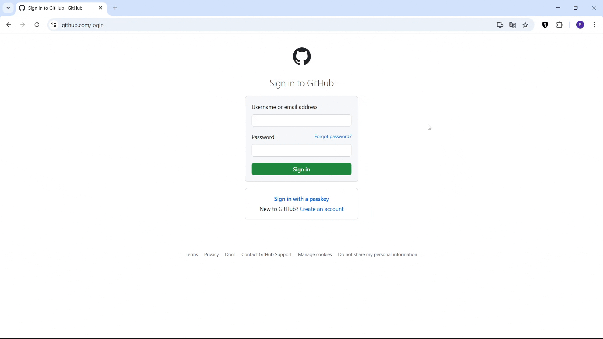

# SYProxy
> Bu Chrome eklentisi, birden fazla proxy bağlantısını kolayca yönetmenizi sağlar. Bir proxy seçip tek bir tıkla internete o proxy üzerinden bağlanabilirsiniz. 

## Açıklama
Sunduğu özellikler:
- Birden fazla proxy kaydı oluşturma
- Tek tıkla hızlı geçiş
- Ayarları dosya olarak dışarı aktarma ve dosyayı içeri aktarma



## İçindekiler
<ol>
	<li>
		<a href="#başlangıç">Başlangıç</a>
		<ul>
			<li><a href="#bağımlılıklar">Bağımlılıklar</a></li>
			<li><a href="#kurulum">Kurulum</a></li>
			<li><a href="#yapılandırma">Yapılandırma</a></li>
		</ul>
	</li>
	<li><a href="#lisans">Lisans</a></li>
	<li><a href="#Iletişim">İletişim</a></li>
</ol>

## Başlangıç
### Bağımlılıklar
Proje aşağıdaki tarayıcılarda test edilmiştir:
- **Google Chrome**
- **Microsoft Edge**

<p align="right">(<a href="#SYProxy">back to top</a>)</p>

---

### Kurulum
1. Bu repository'yi kendi bilgisayarınıza klonlayın:
	```bash
	git clone https://github.com/seymenkonuk/SYProxy.git
	```

2. Projeye gidin:
	```bash
	cd SYProxy
	```

3. Gerekli yapılandırmaları yaptıktan sonra eklentiyi tarayıcınıza kurunuz.
	- Chrome için kurulum aşamaları:
		1. `chrome://extensions/` adresine gidiniz.
		2. **Geliştirici Modu** aktif ediniz.
		3. `build/` klasörünü tarayıcıya sürükleyiniz.

<p align="right">(<a href="#SYProxy">back to top</a>)</p>

---

### Yapılandırma
1. Ayarlarınız, tarayıcının depolamasında şifreli bir şekilde saklanır. Eklenti ayarlarından bu dosyayı dışarı aktarabilir veya içeri aktarabilirsiniz.  Şifreleme anahtarı `build/src/config.min.js` dosyasındaki key bilgisidir. Güvenliğiniz için bu değeri değiştirmelisiniz.
	```js
	export const key="yeni-key-bilgisi";
	```
2. Eklentinin ismini değiştirmek isterseniz:
	- `build/src/config.min.js` dosyasında app_name'i değiştiriniz.
		```js
		export const app_name="yeni-app-ismi";
		```
	- `build/manifest.json` dosyasında **name**'i değiştiriniz.

<p align="right">(<a href="#SYProxy">back to top</a>)</p>

---

## Lisans
Bu proje [MIT Lisansı](https://github.com/seymenkonuk/SYProxy/blob/main/LICENSE) ile lisanslanmıştır.

<p align="right">(<a href="#SYProxy">back to top</a>)</p>

---

## Iletişim
Proje ile ilgili sorularınız veya önerileriniz için bana ulaşabilirsiniz:

GitHub: https://github.com/seymenkonuk

LinkedIn: https://www.linkedin.com/in/recep-seymen-konuk/

Proje Bağlantısı: [https://github.com/seymenkonuk/SYProxy](https://github.com/seymenkonuk/SYProxy)

<p align="right">(<a href="#SYProxy">back to top</a>)</p>

---
